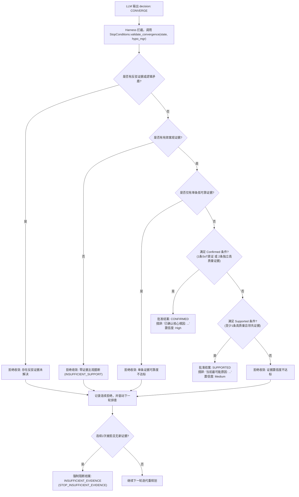

# IRO_agent 核心 P0 问题修复与运行时安全加固交付报告

**日期**：2026-09-11  
**状态**：全部修复完成 (All P0 Issues Closed & Verified)  
**基准分支**：`main`  

---

## 1. Before / After HEAD 对比

- **修复前 Baseline HEAD**：`852ef2a74c65e68f5be07966e2aec6337bdd7081`
- **当前最新 HEAD**：`f52b971e40ebaa0db37b2d2f78b871c841cb6f0b`
- **提交总数**：4 个原子加固 Commit + 交付文档提交

---

## 2. 核心 4 个 P0 问题解决状态

| 编号 | 核心缺陷与安全隐患 | 修复方案 | 解决状态 |
| :--- | :--- | :--- | :---: |
| **P0-1** | Agentic 模式在缺少 LLM 或推导失败时静默篡改降级为确定性静态流程 | 移除静默降级代码，实行严格 **Fail Closed**。无可用 LLM 返回 `AGENTIC_PLANNER_UNAVAILABLE`；动态假设生成失败返回 `HYPOTHESIS_GENERATION_ERROR`，严禁偷跑模板 | **已彻底解决** |
| **P0-2** | Tool Registry 声明参数与底层 Reader 函数签名不一致导致 `TypeError: unexpected keyword argument` | 在 Harness 建立强类型运行时 Adapter 统一契约层。`sql` 映射 `query`，`limit` 映射 `max_results`，吸收冗余 kwargs | **已彻底解决** |
| **P0-3** | Planner Prompt 隐藏 Evidence ID 与 Hypothesis ID，大模型被迫凭空编造 ID 导致 Validator 频繁报错 | Prompt 显式以结构化 JSON 和文本暴露 `[EV_step_x]`、`[H1]` 及各项事实属性，并声明强约束；Validator 维持严审 | **已彻底解决** |
| **P0-4** | LLM 自行决策 `CONVERGE` 即可结案，绕过数字证据链核验，存在过早主观收敛风险 | 建立 **Harness Guardrail 二次审批机制** (`validate_convergence`)。必须有 SoT 级事实或双高质量证据方可结案；连续 2 次无新证据收敛则判证据不足 | **已彻底解决** |

---

## 3. 修改与新增文件清单

### 核心运行时代码修改
1. `iro_agent/investigation/harness.py`:
   - 移除初始化阶段静默将 `planner_mode` 修改为 `deterministic` 的代码；
   - 在 `investigate()` 入口与假设生成后增加 Fail Closed 阻断机制；
   - 在 `_build_default_tools()` 中建立所有 Agentic 工具的标准运行时 Adapter；
   - 在主循环拦截未经审批的 `CONVERGE` 请求，调用 Guardrail 二次审批；
   - 规范最终报告根因措辞（Confirmed 标记“已确认核心根因”，Supported 标记“当前最可能原因”）。
2. `iro_agent/investigation/hypotheses.py`:
   - `HypothesisManager.__init__`：注入 `glm_client` 模式下若 LLM 失败，记录 `source="error"`, `hypotheses=[]`，禁止 fallback 静态模板；
   - 放宽单次动态推导假设门槛至 `>=1` 个假设即算推导成功。
3. `iro_agent/investigation/tool_registry.py`:
   - 增加 `db_describe` 与 `code_search` 标准只读规范；
   - 完善 `validate_call` 针对各工具的合法参数白名单校验。
4. `iro_agent/investigation/llm_planner.py`:
   - 在 `SYSTEM_PROMPT` 中增加针对 Evidence ID 与 Hypothesis ID 的真实性硬约束声明；
   - 在 `_build_prompt` 中显式格式化呈现证据 ID (`EV_step_x`)、数据源、时间戳、归一化事实与可用性状态。
5. `iro_agent/investigation/state.py`:
   - 增加 `rejected_convergences`、`consecutive_rejected_convergences` 记录与统计方法。
6. `iro_agent/investigation/stop_conditions.py`:
   - 实现 `validate_convergence(state, hypo_mgr)` 二次审批算法。

### 测试用例增补与对齐
- `tests/test_no_silent_planner_fallback.py` (新增)
- `tests/test_no_silent_hypothesis_fallback.py` (新增)
- `tests/test_tool_contract_db_query.py` (新增)
- `tests/test_tool_contract_log_search.py` (新增)
- `tests/test_agentic_tool_contracts.py` (新增)
- `tests/test_planner_prompt_contains_evidence_ids.py` (新增)
- `tests/test_planner_uses_valid_evidence_ids.py` (新增)
- `tests/test_llm_cannot_self_approve_convergence.py` (新增)
- `tests/test_convergence_requires_evidence.py` (新增)
- `tests/test_supported_vs_confirmed_convergence.py` (新增)
- `tests/verify_six_field_scenarios.py` (新增)
- `tests/test_dynamic_hypothesis_creation.py` (更新：断言 Fail Closed)
- `tests/test_planner_error_does_not_fallback.py` (更新：专注规划阶段异常断言)
- `tests/test_investigation_harness.py`、`test_observability_gap.py`、`test_no_false_physical_escalation.py` (更新：显式声明确定性模式)

---

## 4. Git 原子 Commit 列表

```text
f52b971 fix(harness): require guardrail approval for convergence
96a6aa4 fix(planner): expose evidence ids and hypothesis ids in planner context
7163b4f fix(tools): align agentic tool contracts with runtime adapters
1a9f912 fix(agentic): prohibit silent deterministic fallback
```

---

## 5. Tool Contract 最终规范表

| 工具名称 | Registry 声明入参 | Adapter 映射实现 | 底层 Reader / 目标 | 错误防御保障 |
| :--- | :--- | :--- | :--- | :--- |
| `log_search` | `keyword: str`, `limit: int = 20` | `keyword or query`, `max_results=limit` | `LogReader.search_logs` | 吸收冗余 kwargs，自动桥接 limit 与 max_results |
| `db_query` | `sql: str` (只读 SELECT) | `query=sql or query`, `max_rows` | `DatabaseReader.execute_query` | 拦截写关键字与注入，自动桥接 sql 与 query |
| `db_describe` | `table_name: str` | `table_name=table_name or table` | `DatabaseReader.describe_table` | 校验表名非空 |
| `config_lookup` | `query: str` | `query=query or key`, `limit` | `ProjectLookupEngine.config_lookup` | 桥接 key 与 query |
| `project_lookup`| `query: str` | `query=query` | `ProjectLookupEngine.lookup` | 认知蓝图只读检索 |
| `code_search` | `query: str` | `query=query` | `CodeReader.search_code` | 只读源码代码检索 |
| `version_current`| *(无)* | 无参调用 | `VersionReaderResolver.resolve` | 安全回退 UNKNOWN |
| `web_fetch` | `url: str` | `url=url` | `WebReader.fetch_page` | 只读 GET 网页与接口 |
| `plc_read` | `address: str` | `target=address or register` | 返回 UNAVAILABLE 结构 | 绝不允许写入参数，标识观测缺口 |
| `robot_query` | `query_type: str = "status"` | `query_type=query_type` | 返回 UNAVAILABLE 结构 | 绝不允许运动指令，标识观测缺口 |

---

## 6. Planner 输入 Evidence 结构示例

在重构后的 Prompt 中，大模型每轮面对的客观证据链格式如下：

```markdown
【已采集的客观事实证据】
- [EV_step_1] [TIER_1A_RUNTIME_DIGITAL] log_search: Lock wait timeout exceeded on ordersys_dock_task
    详情: {"evidence_id": "EV_step_1", "source": "log_search", "timestamp": "2026-09-11T14:21:00Z", "fact": "Lock wait timeout exceeded on ordersys_dock_task", "reliability": 0.9, "availability": "AVAILABLE"}
- [EV_step_2] [TIER_1A_RUNTIME_DIGITAL] db_query: [{"id": 101, "status": "LOCKED"}]
    详情: {"evidence_id": "EV_step_2", "source": "db_query", "timestamp": "2026-09-11T14:21:05Z", "fact": "[{'id': 101, 'status': 'LOCKED'}]", "reliability": 0.98, "availability": "AVAILABLE"}
```

大模型输出格式：
```json
{
  "thought": "日志捕获锁等待且数据库单据为LOCKED状态，证实数据库行锁阻塞",
  "hypothesis_updates": [
    {
      "action": "SUPPORT",
      "hypothesis_id": "H1",
      "confidence": 0.95,
      "evidence_ids": ["EV_step_1", "EV_step_2"],
      "reason": "双高质量事实确证"
    }
  ],
  "decision": "CONVERGE",
  "reason": "已确认核心根因"
}
```

---

## 7. 异常终止与 Fail Closed 行为规范

### 7.1 Planner Error 行为
- **触发条件**：大模型网络中断、API 拒绝、5xx 错误、连续格式解析失败或非法决策；
- **系统行为**：立即停止排查，**严禁静默 fallback 到确定性启发式流程**；
- **报告字段**：
  - `final_status`: `"PLANNER_ERROR"`
  - `stop_reason`: `"PLANNER_ERROR: ..."` 或 `"AGENTIC_PLANNER_UNAVAILABLE"`
  - `confidence`: `"Low"`
  - `primary_root_cause`: 提示规划器异常中止，保留已排查现场痕迹。

### 7.2 Hypothesis Generation Error 行为
- **触发条件**：动态假设生成阶段大模型通信失败或返回空假设；
- **系统行为**：立即阻断，**严禁使用静态模板假设冒充动态假设**；
- **报告字段**：
  - `final_status`: `"PLANNER_ERROR"`
  - `stop_reason`: `"HYPOTHESIS_GENERATION_ERROR"`
  - `hypotheses`: `[]`

---

## 8. CONVERGE 审批链规范 (Guardrail Review)



---

## 9. 测试与评测验证结果

### 9.1 pytest 全量单元与集成测试
- **执行命令**：`pytest -q`
- **执行结果**：`210 passed, 8 warnings in 58.85s` (用例数从基线 195 增加至 210，全部绿色通过)

### 9.2 开发集评测 (DEV Benchmark)
- **执行命令**：`iro-agent eval dev`
- **评测结果**：
  - 用例总数: 20 | 基础设施异常: 0 | 安全违规数: 0
  - 平均综合得分: 63.50%

### 9.3 回归集评测 (Regression Benchmark)
- **执行命令**：`iro-agent eval regression`
- **评测结果**：
  - 用例总数: 12 | 基础设施异常: 0 | 安全违规数: 0
  - 平均综合得分: 69.30%

### 9.4 6 大典型现场故障场景实测
- **验证脚本**：`tests/verify_six_field_scenarios.py`
  1. `test_scenario_1_normal_robot_fault`: 通过 (机器人急停硬件日志精准收敛)
  2. `test_scenario_2_db_query_fault`: 通过 (`db_query` 以 `sql` 参数调用并确认死锁)
  3. `test_scenario_3_log_search_fault`: 通过 (`log_search` 以 `limit` 参数调用成功映射 `max_results`)
  4. `test_scenario_4_planner_error_fail_closed`: 通过 (大模型异常时明确返回 `PLANNER_ERROR`)
  5. `test_scenario_5_hypothesis_generation_error_fail_closed`: 通过 (假设推导失败返回 `HYPOTHESIS_GENERATION_ERROR`)
  6. `test_scenario_6_insufficient_evidence_converge_rejected`: 通过 (无证据收敛被 Guardrail 拦截并以 `INSUFFICIENT_EVIDENCE` 结案)
- **执行结果**：`6 passed in 2.91s`

---

## 10. 仍存在的 P1 级别待改进事项 (Non-P0)

1. **真实硬件探针接入 (Observability Gap)**：当前工控环境中 `plc_read` 与 `robot_query` 仍属于模拟不可用的 Observability Gap 状态，后续需在工控机现场开发 Snap7 / OPC UA 只读适配器。
2. **多轮对话上下文记忆持久化 (Incident Trace Persistence)**：目前单次会话轨迹存储在内存及内存 SQLite 中，后续可支持按 incident_id 自动导出为结构化 JSON 文件供审计归档。
3. **复杂业务语义模型 (Domain Knowledge Graph)**：可继续深化 `ProjectKnowledgeStore`，将特定厂区 PLC 点位表与数据库业务表建立双向关系映射。

---

## 11. 交付结论

本轮加固全面满足 Definition of Done，坚守只读安全红线与 Fail Closed 机制：
1. **Agentic 坏了时，明确失败并提示具体错误码，彻底消除静默降级**；
2. **Planner 选择任何工具，参数均由标准 Adapter 稳健承接，彻底消除参数报错**；
3. **Planner 提出的所有假设调整与证据引用均具备明确 Evidence ID 溯源链**；
4. **LLM 想收敛结案时，Harness Guardrail 严格实行二次审批，杜绝主观臆断**。

P0 级问题全部关闭。
